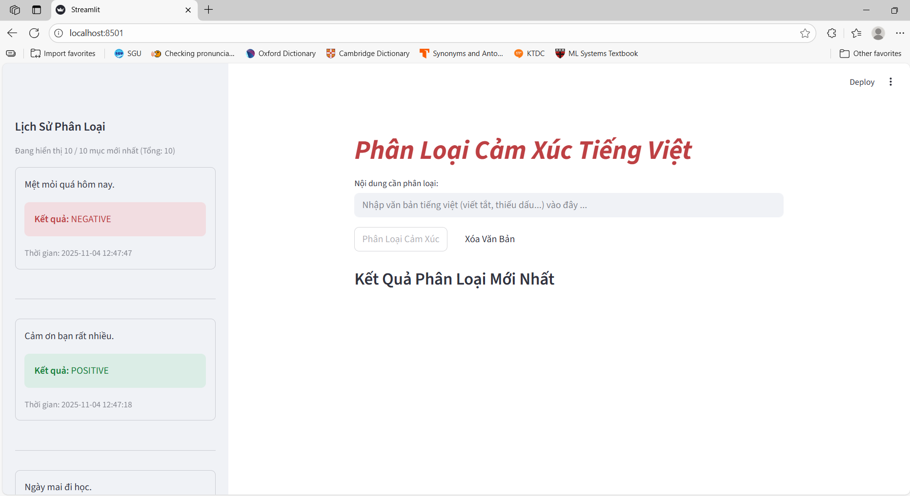

# HƯỚNG DẪN TRUY CẬP SOURCE CODE (Dành cho GV: Thầy Nguyễn Tuấn Đăng)

**Kính gửi Thầy,**

Em là **Phạm Tấn Khương** (MSSV: 3122410191).

Repository này là **Public** để nộp báo cáo. Tuy nhiên, để đảm bảo tính liêm chính học thuật, phần mã nguồn cốt lõi (Source code) được em lưu trữ dưới dạng **Git Submodule (Private)**.

⚠️ **LƯU Ý QUAN TRỌNG:**
Để xem được code bên trong thư mục con, Thầy cần có quyền truy cập vào Repository Private có tên là ***Sentiment_Analysis***. Em đã gửi lời mời (Invite Collaborator) đến email **`ntdsgvn@gmail.com`**.


👉 **Thầy vui lòng kiểm tra Email và Chấp nhận lời mời.**

---

### Link truy cập Source Code
Sau khi đã chấp nhận quyền truy cập, Thấy nhấn vào đường link bên dưới:
https://github.com/svtankhuong/Sentiment_Analysis/tree/b0d850a27fe570f5178b9567579578749db5d437

# 🤖 Trợ lý phân loại Cảm xúc Tiếng Việt (Tên Project)

Đây là project môn **Seminar chuyên đề** dùng Streamlit để demo mô hình AI phân loại cảm xúc cho văn bản tiếng Việt. 



-----

## 🚀 Chức năng chính

  * Phân loại văn bản đầu vào thành 3 nhãn: **POSITIVE** (Tích cực), **NEGATIVE** (Tiêu cực), và **NEUTRAL** (Trung tính).
  * **Tiền xử lý thông minh:** Tự động sửa các từ viết tắt (vd: "ko bt" -\> "không biết") và **khôi phục dấu tiếng Việt** (vd: "hang dep" -\> "hàng đẹp") trước khi phân tích.
  * **Lưu lịch sử:** Hiển thị 50 kết quả phân loại gần nhất trong thanh sidebar.
  * Giao diện đơn giản, dễ sử dụng.

-----

## 🛠️ Công nghệ sử dụng

  * **Ngôn ngữ:** Python
  * **Giao diện (Frontend):** Streamlit
  * **Mô hình AI (Models):**
      * **Sentiment Analysis:** `wonrax/phobert-base-vietnamese-sentiment` (từ Hugging Face)
      * **Diacritic Restoration (Khôi phục dấu):** `bmd1905/vietnamese-correction` (từ Hugging Face)
  * **Thư viện:** `transformers`, `sqlite3`
  * **Database:** SQLite (để lưu lịch sử)

-----

## 📂 Cách chạy project

1. **Cài đặt các thư viện cần thiết:**
   
    ```bash
    pip install -r requirements.txt
    ```

2. **Chạy ứng dụng Streamlit:**

    ```bash
    streamlit run frontend.py
    ```

3. Mở trình duyệt lên và truy cập vào `http://localhost:8501`.

-----

## 🧑‍💻 Tác giả

  * **Họ và tên:** Phạm Tấn Khương
  * **MSSV:** 3122410191
  * **Họ và tên:** Đặng Huỳnh Minh Thái
  * **MSSV:** 31214101448

-----

## Lưu ý
Để đảm bảo tính liêm chính học thuật (academic integrity) và tránh các vấn đề liên quan đến sao chép đồ án, mã nguồn của dự án này hiện không được công khai.
Thầy cô hoặc các bạn quan tâm muốn tham khảo chi tiết, vui lòng liên hệ trực tiếp qua email: tankhuongpham35@gmail.com để được cấp quyền truy cập.

-----
